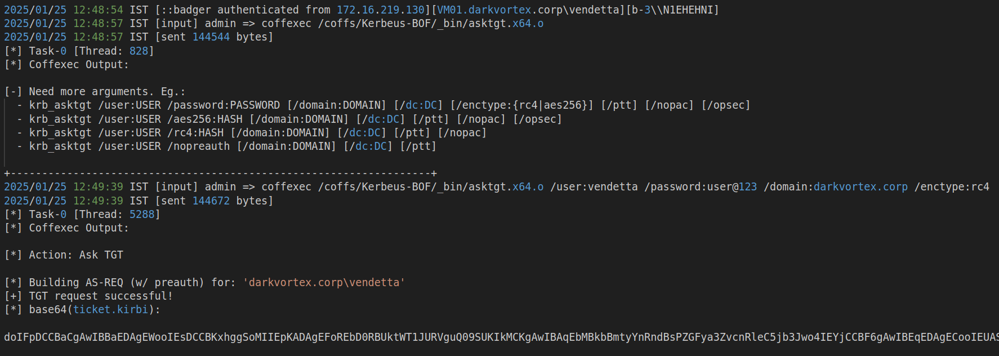
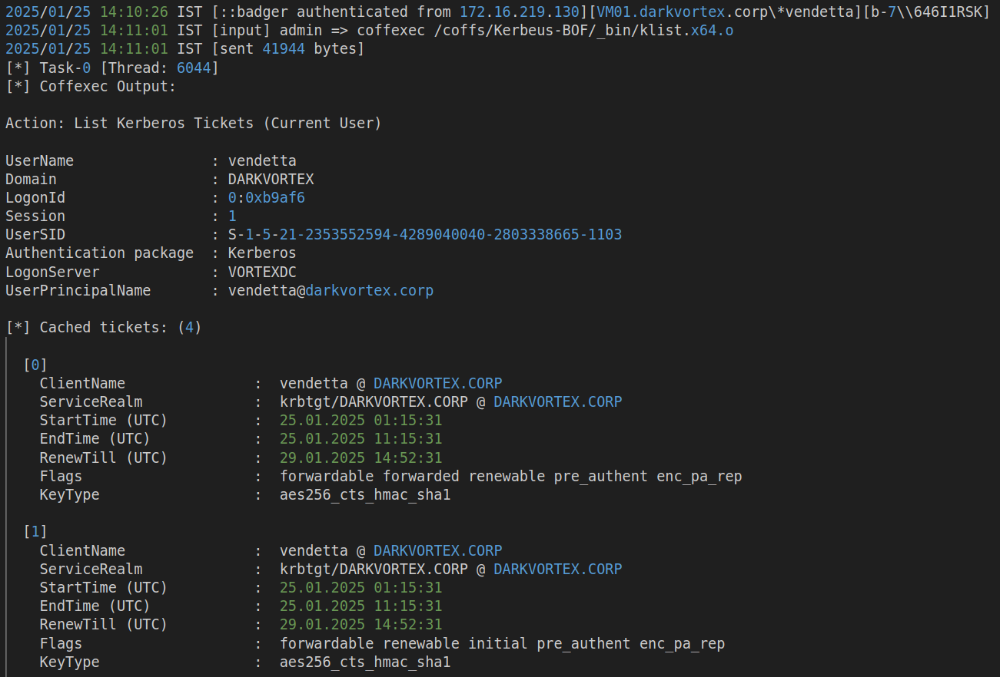
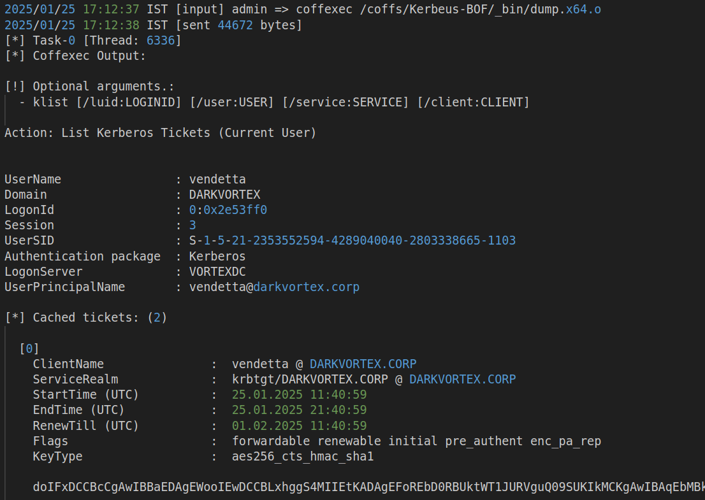
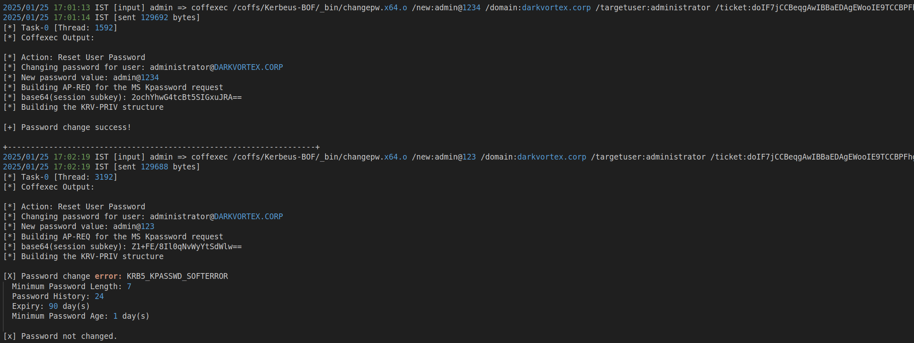

# Kerbeus-BOF

Badger Object Files for Kerberos abuse. This is an implementation of some important features of the [Rubeus](https://github.com/GhostPack/Rubeus) project, written in C.
#### NOTE: Readme file has been modified from the original repo to suit the updated content of Brute Ratel screenshots

## Ticket requests and renewals

### asktgt

The **asktgt** action will build raw AS-REQ (TGT request) traffic for the specified user and encryption key (`/rc4` or `/aes256`). A `/password` flag can also be used instead of a hash - in this case `/enctype:X` will default to RC4. If no `/domain` is specified, the computer's current domain is extracted, and if no `/dc` is specified the same is done for the system's current domain controller. If authentication is successful, the resulting AS-REP is parsed and the KRB-CRED (a .kirbi, which includes the user's TGT) is output as a base64 blob. The `/ptt` flag will "pass-the-ticket" and apply the resulting Kerberos credential to the current logon session. **Also, another opsec note:** only one TGT can be applied at a time to the current logon session, so the previous TGT is wiped when the new ticket is applied when using the `/ptt` option.

To form AS-REQ's more inline with genuine requests, the `/opsec` flag can be used, this will send an initial AS-REQ without pre-authentication first, if this succeeds, the resulting AS-REP is decrypted and TGT return, otherwise an AS-REQ with pre-authentication is then sent.

Requesting a TGT without a PAC can be done using the `/nopac` switch. The `/nopreauth` flag can be used to send an AS-REQ without pre-authentication.

```
asktgt.x64.o /user:USER /password:PASSWORD [/domain:DOMAIN] [/dc:DC] [/enctype:{rc4|aes256}] [/ptt] [/nopac] [/opsec]
asktgt.x64.o /user:USER /aes256:HASH [/domain:DOMAIN] [/dc:DC] [/ptt] [/nopac] [/opsec]
asktgt.x64.o /user:USER /rc4:HASH [/domain:DOMAIN] [/dc:DC] [/ptt] [/nopac]
asktgt.x64.o /user:USER /nopreauth [/domain:DOMAIN] [/dc:DC] [/ptt]
```



### asktgs

The **asktgs** action will build/parse a raw TGS-REQ/TGS-REP service ticket request using the specified TGT `/ticket:X` supplied. This value **must** be a base64 encoding of a .kirbi file. If a `/dc` is not specified, the computer's current domain controller is extracted and used as the destination for the request traffic. The `/ptt` flag will "pass-the-ticket" and apply the resulting service ticket to the current logon session. One or more `/service:X` SPNs **must** be specified, comma separated.

The supported encryption types in the constructed TGS-REQ will be RC4_HMAC and AES256_CTS_HMAC_SHA1. In this case, the highest mutually supported encryption will be used by the KDC to build the returned service ticket. If you want to force RC4 or AES256 keys, use `/enctype:[rc4 or aes256]`.

To form TGS-REQ's more inline with genuine requests, the `/opsec` flag can be used, this will also cause an additional TGS-REQ to be sent automatically when a service ticket is requested for an account configured for unconstrained delegation.

The `/u2u` flag was implemented to request User-to-User tickets. Together with the `/tgs:X` argument (used to supply the target accounts TGT), the `/service:X` argument can be the username of the account the supplied TGT is for (with the `/tgs:X` argument). The `/targetuser:X` argument will request a PAC of any other account by inserting a PA-FOR-USER PA data section with the `target user's` username.

The `/keyList` flag was implemented for Kerberos [Key List Requests](https://learn.microsoft.com/en-us/openspecs/windows_protocols/ms-kile/732211ae-4891-40d3-b2b6-85ebd6f5ffff). These requests must utilise a forged partial TGT from a read-only domain controller in the `/ticket:BASE64` parameter. Furthermore, the `/spn:x` field must be set to the KRBTGT SPN within the domain, eg. `KRBTBT/domain.local`.

```
asktgs.x64.o /ticket:BASE64 /service:SPN1,SPN2,... [/domain:DOMAIN] [/dc:DC] [/tgs:BASE64] [/targetdomain:DOMAIN] [/targetuser:USER] [/enctype:{rc4|aes256}] [/ptt] [/keylist] [/u2u] [/opsec]
```


### renew

The **renew** action will build/parse a raw TGS-REQ/TGS-REP TGT renewal exchange using the specified `/ticket:X` supplied. This value must be a base64 encoding of a .kirbi file. If a `/dc` is not specified, the computer's current domain controller is extracted and used as the destination for the renewal traffic. The `/ptt` flag will "pass-the-ticket" and apply the resulting Kerberos credential to the current logon session.

```
renew.x64.o /ticket:BASE64 [/dc:DC] [/ptt]
```


## Constrained delegation abuse

If a user (or computer) account is configured for constrained delegation (i.e. has a SPN value in its msds-allowedtodelegateto field) this action can be used to abuse access to the target SPN/server. 

A **TL;DR** explanation is that an account with constrained delegation enabled is allowed to request tickets _to itself_ as any user, in a process known as S4U2self. In order for an account to be allowed to do this, it has to have **TrustedToAuthForDelegation** enabled in it's useraccountcontrol property, something that only elevated users can modify by default. This ticket has the **FORWARDABLE** flag set by default. The service can then use this specially requested ticket to request a service ticket to any service principal name (SPN) specified in the account's **msds-allowedtodelegateto** field. So long story short, if you have control of an account with **TrustedToAuthForDelegation** set and a value in **msds-allowedtodelegateto**, you can pretend to be any user in the domain to the SPNs set in the account's **msds-allowedtodelegateto** field.

S4U2self ticket can then be used as a `/tgs:Y` parameter (base64 blob) to execute the S4U2proxy process. A valid **msds-allowedtodelegateto** value for the account must be supplied (`/service:X`).

The `/altservice` parameter allows us to substitute in any service name we want in the resulting KRB-CRED file. One or more alternate service names can be supplied, comma separated (`/altservice:cifs,HOST,...`).

To form the TGS-REQ's more inline with genuine requests, the `/opsec` flag can be used. 

It is possible, in certain cirsumstances, to use an S4U2Self ticket to impersonate protected users in order to escalate privileges on the requesting system, as discussed [here](https://exploit.ph/revisiting-delegate-2-thyself.html). For this purpose, the `/self` flag and `/altservice:X` argument can be used to generate a usable service ticket.

To forge an S4U2Self referral, only the trust key is required. By using the `/targetdomain:X` argument with the `/self` flag and without the `/targetdc` argument, it will treat the ticket supplied with `/ticket:X` as an S4U2Self referral and only request the final S4U2Self service ticket. The `/altservice:X` can also be used to rewrite the sname in the resulting ticket.

```
s4u.x64.o /ticket:BASE64 /service:SPN {/impersonateuser:USER | /tgs:BASE64} [/domain:DOMAIN] [/dc:DC] [/altservice:SERVICE] [/ptt] [/nopac] [/opsec] [/self]
cross_s4u.x64.o /ticket:BASE64 /service:SPN /targetdomain:DOMAIN /targetdc:DC {/impersonateuser:USER | /tgs:BASE64} [/domain:DOMAIN] [/dc:DC] [/altservice:SERVICE] [/nopac] [/self]
```

## Ticket Management

### ptt

The **ptt** action will submit a `/ticket:X` (TGT or service ticket) for the current logon session through the LsaCallAuthenticationPackage() API with a KERB_SUBMIT_TKT_REQUEST message, or (**if elevated**) to the logon session specified by `/luid:ea4..`. Like other `/ticket:X` parameters, the value can be a base64 encoding of a .kirbi file.

```
ptt.x64.o /ticket:BASE64 [/luid:LOGONID]
```


### purge

The **purge** action will purge all Kerberos tickets from the current logon session, or (if elevated) to the logon session specified by `/luid:0xA..`.

```
purge.x64.o [/luid:LOGONID]
```


### describe

The **describe** action takes a `/ticket:X` value (TGT or service ticket), parses it, and describes the values of the ticket. Like other `/ticket:X` parameters, the value can be a base64 encoding of a .kirbi file.

```
describe.x64.o /ticket:BASE64
```


### klist

The **klist** will list detailed information on the current user's logon session and Kerberos tickets, if not elevated. If run from an elevated context (**SYSTEM**), information on all logon sessions and associated Kerberos tickets is displayed. Logon and ticket information can be displayed for a specific LogonID with `/luid:3ea..` (if elevated).

```
klist.x64.o [/luid:LOGINID] [/user:USER] [/service:SERVICE] [/client:CLIENT]
```




### dump

The **dump** action will extract current TGTs and service tickets if in an elevated context (**SYSTEM**). If not elevated, service tickets for the current user are extracted.

```
dump.x64.o [/luid:LOGINID] [/user:USER] [/service:SERVICE] [/client:CLIENT]
```



### triage

The **triage** action will output a table of the current user's Kerberos tickets, if not elevated. If run from an elevated context (**SYSTEM**), a table describing all Kerberos tickets on the system is displayed.

```
triage.x64.o [/luid:LOGINID] [/user:USER] [/service:SERVICE] [/client:CLIENT]
```


#### filters

For the `klist`, `triage` and `dump`, tickets can be filtered by `/luid`, `/service` and `/client`.

**Need SYSTEM context**.

### tgtdeleg

The **tgtdeleg** abuses the Kerberos GSS-API to retrieve a usable TGT for the current user without needing elevation on the host. AcquireCredentialsHandle() is used to get a handle to the current user's Kerberos security credentials, and InitializeSecurityContext() with the ISC_REQ_DELEGATE flag and a target SPN of CIFS/DC.domain.com to prepare a fake delegate context to send to the DC. This results in an AP-REQ in the GSS-API output that contains a KRB_CRED in the authenticator checksum. The service ticket session key is extracted from the local Kerberos cache and is used to decrypt the KRB_CRED in the authenticator, resulting in a usable TGT .kirbi.

If automatic target/domain extraction is failing, a known SPN of a service configured with unconstrained delegation can be specified with `/target:SPN`.

```
tgtdeleg.x64.o [/target:SPN]
```


## Roasting

### kerberoasting

The **kerberoasting** is used to request the appropriate service ticket. The `/ticket:X` argument specifies the domain user's TGT ticket. The `/spn:X` argument specifies the target SPN. The `/domain` and `/dc` arguments are optional and retrieve system defaults just like the other actions.

The `/nopreauth:USER` argument will attempt to send an AS-REQ with the service passed to `/spn:Y` to request service tickets.

```
kerberoasting.x64.o /spn:SPN [/nopreauth:USER] [/dc:DC] [/domain:DOMAIN]
kerberoasting.x64.o /spn:SPN /ticket:BASE64 [/dc:DC]
```


### asreproasting

If a domain user does not have Kerberos preauthentication enabled, an AS-REP can be successfully requested for the user, and a component of the structure can be cracked offline a la kerberoasting. The `/user:X` argument specifies the target user. The `/domain` and `/dc` arguments are optional, pulling system defaults as other actions do.

```
asreproasting.x64.o /user:USER [/dc:DC] [/domain:DOMAIN]
```


## Miscellaneous

### hash

The **hash** action will take a `/password:X` and optional `/user:USER` and/or `/domain:DOMAIN`. It will generate the rc4_hmac (NTLM) representation of the password. If user and domain names are specified, the aes128_cts_hmac_sha1 and aes256_cts_hmac_sha1 hash forms are generated. The user and domain names are used as salts for the AES implementations.

```
hash.x64.o /password:PASSWORD [/user:USER] [/domain:DOMAIN]
```


### changepw

The **changepw** action will take a user's TGT .kirbi blob and execute a MS kpasswd password change with the specified `/new:PASSWORD` value. If a `/dc` is not specified, the computer's current domain controller is extracted and used as the destination for the password reset traffic.

The `/targetuser` and `/targetdomain` arguments can be used to change the password of other users, given the user whose TGT it is has enough privileges.

**Note that either a users TGT or a service ticket for kadmin/changepw can be used to change the password**

```
changepw.x64.o /ticket:BASE64 /new:PASSWORD [/dc:DC] [/targetuser:USER] [/targetdomain:DOMAIN]
```



## Credits
* Rubeus - https://github.com/GhostPack/Rubeus
* nanorobeus - https://github.com/wavvs/nanorobeus
